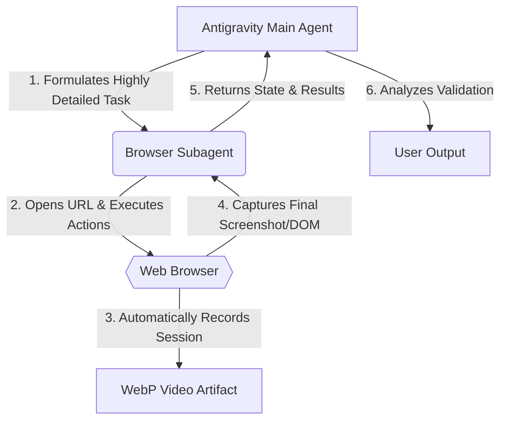
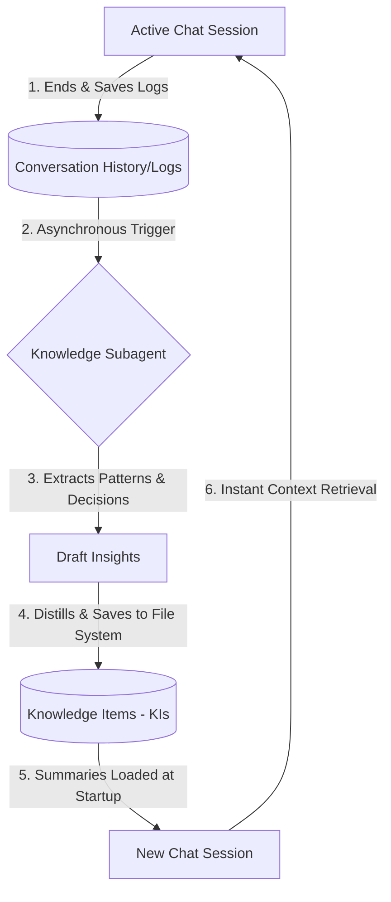

# Antigravity Subagents Architecture

Antigravity utilizes a robust subagent architecture to handle complex, specialized, and asynchronous tasks. By delegating specific workloads to autonomous sub-entities, the main agent remains focused on high-level reasoning, code generation, and direct collaboration with the user.

Currently, Antigravity relies entirely on two powerful **Native Subagents** deeply integrated into its core architecture.

---

## 1. The Browser Subagent (Visual Web Automation)

The Browser Subagent is a dedicated, autonomous graphical agent equipped with specialized tools meant exclusively for understanding and controlling a web browser. It operates via a "one-shot" execution model based on a highly detailed prompt from the main agent.

### Key Capabilities

- **DOM Interaction:** Can navigate to URLs, click elements, type text, scroll, and solve complex UI workflows.
- **Visual Proof:** Every interaction is automatically recorded and saved as a **WebP video** artifact.
- **E2E Testing:** Ideal for verifying CSS changes, testing Single Page Applications (SPAs), or extracting data from highly dynamic pages without requiring user intervention.

### Mechanism

---

## 2. The Knowledge Subagent (Background Memory)

A core challenge in long-running AI projects is context degradation (forgetting past architectural decisions due to context limits). The Knowledge Subagent solves this by running asynchronously in the background.

### Key Capabilities

- **Log Distillation:** It asynchronously reads through completed conversation logs and extracts recurring bugs, architectural decisions, and project patterns.
- **Knowledge Items (KIs):** It converts raw chat logs into permanent, highly structured markdown documents called Knowledge Items.
- **Context Injection:** When a new session begins, the main agent reads the KI summaries to instantly regain context without repeating old mistakes.

### Mechanism

---

## 3. Core Operational Concepts

To manage workflows and ensure high-quality output, Antigravity employs several organizational and behavioral systems alongside its subagents.

### Task Groups

When operating in "Planning Mode" for intricate tasks, Antigravity utilizes **Task Groups** to deconstruct massive projects into smaller, manageable units of work.

- **Concurrency:** Allows the Agent to tackle multiple aspects of a task concurrently.
- **Structure:** Each Task Group explicitly outlines the primary objective, summarizes modifications, lists edited files, and details subtasks with individual steps.
- **Verification:** Task Groups often include actions awaiting user approval. The agent halts code execution until the generated plan is reviewed and approved by the developer.

### Rules & Workflows

Behavioral constraints and automation are managed via Rules and Workflows, configurable within the Antigravity settings.

- **Rules (Passive Constraints):** Rules act as "always-on" system instructions or permanent guidelines. They dictate consistent behavior, such as enforcing specific code styling standards (e.g., TS Strict Mode), ensuring documentation, or preventing the commitment of sensitive secrets. Rules can be applied globally or tied to specific file patterns via Globs.
- **Workflows (Active Automation):** Workflows are user-triggered, on-demand sequences of steps designed to automate repetitive tasks (e.g., generating unit tests, deploying a service). They are explicitly invoked by the user, often via slash commands, and can call other workflows to handle complex sequences.

### Task Lists (Artifacts)

Because Antigravity is an "agent-first" architecture, it relies heavily on generating tangible **Artifacts** to prove its work.

- **The Artifact:** A Task List (commonly represented as a `task.md` file) is a core structural artifact.
- **Function:** It serves as a living document to track progress toward the overall objective, providing verifiable proof of completed steps, active pursuits, and remaining checklist items for the main agent and subagents.
